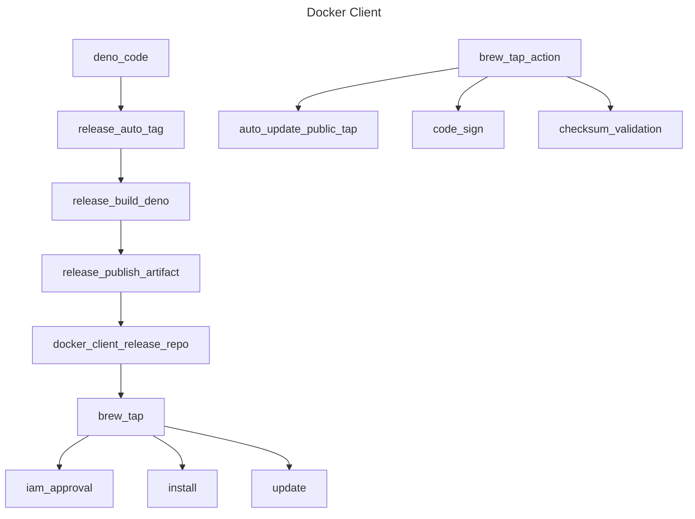

<!-- markdownlint-disable MD041 -->
<!-- markdownlint-disable MD012 -->
# @softdist/docker

The @softdist jsr.io scope is used to package the Lyns Docker Client!

* Based on @rainypixel but tailored for creating and attaching to containers
* Also designed to run distrolss containers as scripted actions.

# **Docker Bake**

## GitHub packager

### Package

| Name | Purpose |
| -- | -- |
| sd-install | Installer for creating necessary configuration files |
| sd-run | Portable Docker Client for running child and parent containers |
| sd-explicate | Secrets explication for decryption of encrypted secrets in any container or on your host |
| sd-crypto | Unavailable currently.  In development.  Will be used for encryption using KeePass encrypted DBs |

### Program Commands

| Command | Purpose |
| -- | -- |
| child | Creates and starts docker containers from images based on the -i flag and using other flags for options. |
| parent | Creates and starts parent containers, which require different mounts and permissions. |

<!-- github feature -->
<!-- markdownlint-disable MD033 -->
<details>
  <summary>About Parent/Child Containers</summary>

    ## Parent containers

    Parent containers are designed to run our DSO CLI, which is a portable test runner and CI system that runs in child containers.
    The purpose of parent containers is to volume mount files from both the parent and child containers, and to isolate child container
    workloads for the purpose of running integration test environments locally.

    ## Child containers

    For speed the system is designed to run immutable docker images locally without the need to setup and run the docker client.
    The `sd-run` CLI acts as it's own full duplex Docker CLI, bringing you directly into the container upon launch.
    This allows you to run containers as code right on your host machine.  All files from those containers can be volume mounted from
    the local `.cache.child` directory in the working directory with which you run the CLI.
</details>

## Features

* Single Dockerfile for all builds
* Deno check
  * Mocks
  * Unit tests
  * Integration Tests

## Compiler process

<!-- github feature -->
<!-- markdownlint-disable MD033 -->
<details>
  <summary>Detailed Compile-Time Information</summary>
* Deno compile targets loop:
  * For each platform:
    * Compile all binaries and store them in a single ‘installer’:
    * Tar up all the installers for the ‘all platforms’
    * Install.ts
      * \<os\>.\<platform\>/install
      * revise so this install actually contains the compiled binary files for all the below scripts embedded in a key/value store so these files can be exported to the user’s computer for the os/platform this install runs under.
      * Cosign this single binary
      * Once the files are extracted to the current $binPath ‘configure is called’
      * All child files must be compiled first:
    * sd-install.ts
      * \<os\>.\<platform\>/configure
    * sd-run.ts
      * \<os>.\<platform>/install
    * sd-extricate.ts
      * \<os>.\<platform>/install
    * sd-crypto.ts
    * sd-keepass.ts
</details>

### Supported Platforms


> [!IMPORTANT]
>
> The following platforms are *currently* supported:

* darwin
  * amd64
  * arm64
* linux
  * amd64
  * arm64
* windows
  * amd64
  * -arm64- (unsupported)

## GitHub Release

Our CI Build currently creates all binary artifacts using a Deno compile process and pushes them to:

[softdist/docker.client](https://github.com/softdist/docker.client)

### Brew install softdist/client

Below is a list of features we are currently targeting which allow for a private Homebrew tap to
download the binary artifacts published by the release, checksum validate, codesign, and install them.

We may need to move the codesign process into the release process but that's currently unclear.

### Tap Process Overview

* Ruby detects platform
  * Fetch latest version tag
  * Fetch latest release binary:
    * Tag
    * OS
    * Platform
  * Validate checksum & signing

#### Binary kick-off


> [!IMPORTANT]
>
> This is a standard brew tap which installs and symlinks binaries on a local machine for
> Linux, Mac, and Windows.   We are adding in certain functionality for security, as this is paramount
> since parent containers require root permissions.  Child containers do not require root.


## Install Tap

Built with Ruby for Homebrew using a private repository tap, which requires a fork of the Homebrew taps repo.

* Installer ALWAYS copies the latest binaries
  * Get latest version
  * Verify binary checksums
  * Validate codesignatures
  * Validate GPG signature of author
    * We may need a feature to output this from the installer
  * Migrate the binaries into position & symlink them using Brew


Click here for full process

<!-- github feature -->
<!-- markdownlint-disable MD033 -->
<details>
        <summary>Details on Homebrew tap installation development workflow</summary>
        # Homebrew Installation for `softdist-release`

        ## Overview
        This guide details how to set up Homebrew installation for the `softdist-release` binary with:
        - Automated binary selection for macOS and Linux.
        - Checksum validation before installation.
        - Code signing and notarization to avoid OS warnings.
        - Seamless `brew install softdist-release` support.

        ---

        ## 1. Setting Up a Homebrew Tap
        To distribute your binary via Homebrew, create a Homebrew Tap repository.

        ### Steps to Create the Tap
        1. Create a GitHub repository: `softdist/homebrew-softdist`
        2. Inside the repo, add the following formula file:  
        **`Formula/softdist-release.rb`**

        ---

        ## 2. Homebrew Formula (`softdist-release.rb`)
        This formula:
        - Downloads the appropriate binary for the OS.
        - Validates the SHA256 checksum before installation.
        - Runs `codesign` on macOS to prevent security warnings.

        ```ruby
        class SoftdistRelease < Formula
        desc "Docker client emulator"
        homepage "https://github.com/softdist/docker.client"
        version "0.1.8"
        license "MIT"

        if OS.mac? && Hardware::CPU.arm?
            url "https://github.com/softdist/docker.client/releases/download/v0.1.8/docker.client-darwin-arm64"
            sha256 "<SHA256_MAC_ARM64>"
        elsif OS.mac? && Hardware::CPU.intel?
            url "https://github.com/softdist/docker.client/releases/download/v0.1.8/docker.client-darwin-amd64"
            sha256 "<SHA256_MAC_AMD64>"
        elsif OS.linux? && Hardware::CPU.arm?
            url "https://github.com/softdist/docker.client/releases/download/v0.1.8/docker.client-linux-arm64"
            sha256 "<SHA256_LINUX_ARM64>"
        elsif OS.linux? && Hardware::CPU.intel?
            url "https://github.com/softdist/docker.client/releases/download/v0.1.8/docker.client-linux-amd64"
            sha256 "<SHA256_LINUX_AMD64>"
        else
            odie "Unsupported architecture"
        end

        def install
            bin.install "docker.client"
        end

        def post_install
            if OS.mac?
            system "codesign", "--force", "--deep", "--sign", "-", "#{bin}/docker.client"
            end
        end

        test do
            system "#{bin}/docker.client", "--version"
        end
        end

        3. Automating Code Signing with GitHub Actions

        To prevent macOS security warnings, you must sign and notarize the binaries.

        Required Secrets

        In GitHub Actions Secrets, store the following:
            - APPLE_CERTIFICATE → (Base64-encoded .p12 certificate)
            - APPLE_CERT_PASSWORD → (Password for the .p12 file)
            - APPLE_TEAM_ID → (Your Apple Developer Team ID)
            - APPLE_ID → (Apple Developer email)
            - APPLE_ID_PASSWORD → (App-specific password)

        4. GitHub Actions Workflow

        This workflow:
            - Downloads macOS binaries.
            - Signs them using codesign.
            - Notarizes them with Apple.
            - Uploads the signed binaries to GitHub Releases.

        .github/workflows/sign-macos.yml

        name: Sign and Notarize macOS Binary

        on:
        release:
            types: [published]

        jobs:
        sign-macos:
            runs-on: macos-latest
            steps:
            - name: Checkout repository
                uses: actions/checkout@v4

            - name: Install Apple Certificate
                run: |
                echo "$APPLE_CERTIFICATE" | base64 --decode > certificate.p12
                security create-keychain -p "" build.keychain
                security default-keychain -s build.keychain
                security unlock-keychain -p "" build.keychain
                security import certificate.p12 -k build.keychain -P "$APPLE_CERT_PASSWORD" -T /usr/bin/codesign
                security set-key-partition-list -S apple-tool:,apple: -s -k "" build.keychain

            - name: Download macOS binaries
                run: |
                curl -L -o docker.client-darwin-arm64 https://github.com/softdist/docker.client/releases/download/v0.1.8/docker.client-darwin-arm64
                curl -L -o docker.client-darwin-amd64 https://github.com/softdist/docker.client/releases/download/v0.1.8/docker.client-darwin-amd64
                chmod +x docker.client-*

            - name: Code Sign Binaries
                run: |
                codesign --force --deep --sign "Developer ID Application: $APPLE_TEAM_ID" docker.client-darwin-arm64
                codesign --force --deep --sign "Developer ID Application: $APPLE_TEAM_ID" docker.client-darwin-amd64

            - name: Notarize Binaries
                run: |
                xcrun notarytool submit docker.client-darwin-arm64 \
                    --apple-id "$APPLE_ID" --password "$APPLE_ID_PASSWORD" --team-id "$APPLE_TEAM_ID"
                xcrun notarytool submit docker.client-darwin-amd64 \
                    --apple-id "$APPLE_ID" --password "$APPLE_ID_PASSWORD" --team-id "$APPLE_TEAM_ID"

            - name: Upload Signed Binaries
                uses: softprops/action-gh-release@v2
                with:
                files: |
                    docker.client-darwin-arm64
                    docker.client-darwin-amd64

        5. Updating Homebrew Formula with Checksums

        Once the signed binaries are uploaded to GitHub Releases, update the SHA256 hashes:

        shasum -a 256 docker.client-darwin-arm64
        shasum -a 256 docker.client-darwin-amd64

        Then, commit the formula to your Homebrew Tap repo:

        git clone https://github.com/softdist/homebrew-softdist.git
        cd homebrew-softdist
        git add Formula/softdist-release.rb
        git commit -m "Add softdist-release formula"
        git push origin main

        6. Installing via Homebrew

        Users can now install softdist-release using a single command:

        brew tap softdist/softdist
        brew install softdist-release

        Or, if you make it a public tap:

        brew install softdist-release

        Final Thoughts
        - Code Signing & Notarization: Prevents macOS security warnings.
        - Checksum Validation: Ensures download integrity.
        - Single Brew Install Command: No need for manual script execution.
        - GitHub Actions Workflow: Fully automates macOS binary signing.

        This setup ensures a secure, smooth installation experience via Homebrew.

</details>


# Logical Diagram

<!-- github feature -->
<!-- markdownlint-disable MD046 -->


## Softweare Logical Layout

* Software Objects included in the release:
  * Tap
    * Checksum validation
    * Codesigning
    * Homebrew fork
  * Installed Objects
    * Child containers
      * Create
      * Start
      * Attach full duplex
      * Compose - a group of containers run with Docker Compose **Not Supported Yet**
    * Parent containers
      * Create
      * Start
      * Attach full duplex
    * Secrets Management
      * Automatic Docker Registry encryption
      * Decryption through Explication
      * Secure Decryption in containers
      * Tmpfs mounts for secrets in containers
    * Encrypted code
      * Local configurations encrypted at git-push
      * Transcrypt utilization
    * Encrypted databases
      * Keepass database secret management
      * CI secrets
    * Configure local environment
      * Fish
      * Nushell
      * Bash

